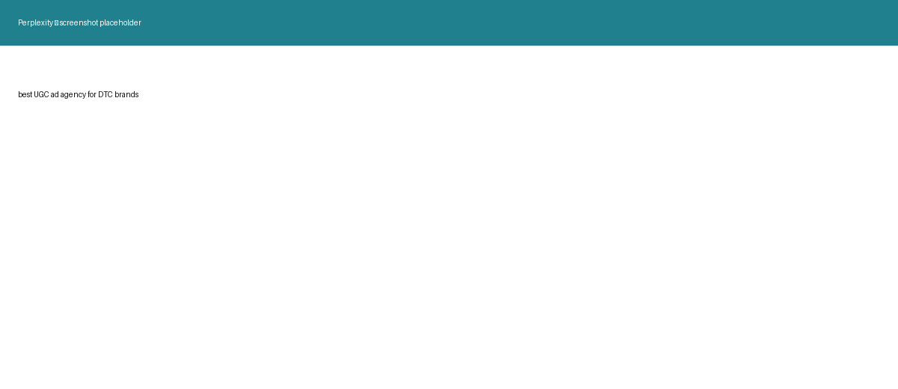

Icon is about to launch. A launch drives a wave of people hearing the name for the first time and asking an AI whether Icon is any good. We ran those queries this week. The results below are unedited and reproducible.

# What we found

We ran the questions your buyers actually ask, in the engines they ask them in.

| Prompt (Perplexity, 2026-07-31) | Who got named | icon |
|---|---|---|
| best UGC ad agency for DTC brands | Brighter Click, MHI Media, The Influence Agency, New Engen, MuteSix | Not named |
| best AI ad generator for ecommerce brands | Creatify, Shhots AI, AdCreative.ai | Not named |
| Billo alternatives for UGC video ads | Insense, Collabstr, JoinBrands, Influee, Trend.io | Not named |

The second row matters most. Icon names Billo directly on your own pricing page. When a buyer asks for Billo alternatives — the exact query of someone already in market — five companies come back and none is Icon.

Then we asked about Icon by name. The engine knows you. What it says is the problem: it answers from Trustpilot and review aggregators, hedges in the first sentence, and surfaces concerns about pricing, terms, and product limitations.

> **Your brand-level answer is currently written by review sites, not by anything Icon controls.** That is the query a launch multiplies.

## Where Icon stands today

| Metric (Semrush, Jul 2026) | Value |
|---|---|
| AI Visibility score | 18 |
| Mentions in AI answers | 24 |
| Pages cited by AI | 36 |
| Organic traffic / mo | 8.6K +3.1% |
| Organic keywords | 1.9K −15% |
| Paid keywords | 0 |

# Why this is happening

icon isn't missing from these answers because the work isn't good enough. It's missing for specific reasons, and all of them are fixable. Each one is below with the track that fixes it.

### Your site never tells the AI what you are

When someone asks an AI who to hire, it looks for structured information on your site that says what the company does, what it sells, and what people think of it. icon.com has none of that. So the AI fills the gap with whatever other websites have said about you, which is why the answer about icon comes back in someone else's words.

*What we measured: present: none; absent: Organization, WebSite, Service/Product, FAQPage, Review; ChatGPT: 34 page(s) cited.*

**Fixed by Track 1, Own the branded answer.**

### The pages the AI quotes don't mention you

Category answers get built from third party roundups and buyer's guides, not from your own website. Those are the pages getting quoted and icon isn't on any of them. Right now there is no path for the AI to name you, no matter how good the work is.

*What we measured: “best UGC ad agency for DTC brands” (Perplexity, 2026-07-31) — not named; returned: Brighter Click, MHI Media, The Influence Agency, New Engen, MuteSix; “best AI ad generator for ecommerce brands” (Perplexity, 2026-07-31) — not named; returned: Creatify, Shhots AI, AdCreative.ai; “Billo alternatives for UGC video ads” (Perplexity, 2026-07-31) — not named; returned: Insense, Collabstr, JoinBrands, Influee, Trend.io.*

**Fixed by Track 2, Enter the category set.**

### Nothing you own answers the buying question

When someone asks if icon is any good, the AI needs a page that answers that. icon.com doesn't have one. So it pulls from review aggregators instead, and those get written by unhappy customers way more often than happy ones.

*What we measured: “Is Icon (icon.com) a good service for UGC video ads?” (Perplexity, 2026-07-31) — cited: trustpilot.com; Answer sourced from review aggregators; raises concerns about pricing, terms and product limitations..*

**Fixed by Track 1, Own the branded answer.**

### Your pages describe the product, not the decision

The AI platforms are crawling icon.com constantly, that part is working fine. The problem is what they find when they get there. They read it as product information rather than an answer to “who should I hire,” so all that crawling turns into citations without recommendations.

*What we measured: source: Semrush; ChatGPT: 3 mention(s) from 34 cited page(s); Google AI Overviews: 2 mention(s) from 3 cited page(s).*

**Fixed by Track 3, Capture the launch.**

### Access isn't the problem

Every major AI crawler is allowed in and your sitemap is declared. Worth saying because it's usually the first thing an agency will sell you a fix for. Yours is already right.

# The plan

Each track has three parts: what's wrong now, what we actually build, and which number it moves. Nothing here is vague activity. Everything listed either exists at the end of it or it doesn't.

### Track 1 — Own the branded answer

**What's wrong today**

- Asked about the brand by name, the engine answers from trustpilot.com and not from icon.com. The tone is hedged.
- The homepage carries no structured data at all — 0 JSON-LD blocks. Nothing on the site tells an engine what this company is or what it sells. Gemini cites zero pages.

**What we build**

- Citable answers for is-Icon-legit / pricing / vs-Billo / vs-Soona
- Review velocity across Trustpilot, G2, Capterra
- Organization, Service, FAQPage, Review schema

**What stops being missing**

- An owned page icon.com controls that answers “Is Icon (icon.com) a good service for UGC video ads?”
- Organization structured data on the homepage
- WebSite structured data on the homepage
- Service/Product structured data on the homepage
- FAQPage structured data on the homepage
- Review structured data on the homepage

**What it moves**

- **Branded answer sentiment** — hedged today, neutral by day 90 (positive if it runs hot). Fastest row. Depends only on owned sources existing.
- **Pages cited — Gemini** — 0 today, 3 by day 90 (6 if it runs hot). Blocked on schema and entity work; expect nothing for the first 30 days, then a step change.

**First results:** weeks · **Effort:** medium

**We need from you:** Customer list for review outreach; Named approver.

### Track 2 — Enter the category set

**What's wrong today**

- Absent from all 3 discovery prompts. 13 other companies were named instead.

**What we build**

- Comparison pages vs Billo, Soona, Arcads, Insense
- Outreach to roundup maintainers
- Directory and review profiles claimed

**What stops being missing**

- Presence in the sources that answer “best UGC ad agency for DTC brands”
- Presence in the sources that answer “best AI ad generator for ecommerce brands”
- Presence in the sources that answer “Billo alternatives for UGC video ads”

**What it moves**

- **Discovery prompts naming the client** — 0 of 3 today, 1 by day 90 (2 if it runs hot). Slowest row. Depends on third-party roundups, which take 60 to 90 days to surface in citations.
- **AI Visibility score** — 18 today, 26 by day 90 (34 if it runs hot). Composite; moves as the underlying layers move.

**First results:** 3-6 months · **Effort:** high

### Track 3 — Capture the launch

**What's wrong today**

- ChatGPT reads 34 pages on the site and names the brand 3 time(s). The pages are being crawled and are not producing recommendations.

**What we build**

- Launch coverage structured and syndicated
- Post-launch re-run of the full prompt set

**What stops being missing**

- Pages that answer a hiring question directly — ChatGPT currently finds 31 page(s) it reads but does not cite in an answer

**What it moves**

- **AI Visibility score** — 18 today, 26 by day 90 (34 if it runs hot). Composite; moves as the underlying layers move.

**First results:** weeks · **Effort:** medium

# What changes, measured

| Metric | Today | Day 90 | Stretch |
|---|---|---|---|
| AI Visibility score | 18 | 26 | 34 |
| Category prompts naming Icon (of 5) | 0 | 2 | 3 |
| Pages cited — Gemini | 0 | 3 | 6 |
| Third-party roundups including Icon | 0 | 2 | 4 |

Branded sentiment moves fastest — it depends on sources existing, and we can create those. Category placement moves slowest, because the roundup articles the engines cite take 60–90 days to accumulate.

# Proof

In seven weeks we moved the International Advertising Association's target keywords from 52→15, 61→12, 58→11, 75→10 and 67→9. Over the year: new users +31.3%, engaged sessions +25%.

> We don't yet have a published AI-visibility case study — the practice is newer than our SEO work. What IAA demonstrates is the same machinery, pointed at a different surface.

# Investment

|  | LAUNCH SPRINT | FOUNDATION | FULL |
|---|---|---|---|
| Monthly | $2,000 | $4,000 | $7,000 |
| Term | 6 months | 6 months | 6 months |
| Branded answer work | Included | Included | Included |
| Category entry | Client | Included | Included |
| Outreach execution | Client | Drafts only | Included |
| **Total contract value** | **$12,000** | **$24,000** | **$42,000** |

# Next steps

Confirm your option below. We send the agreement and first invoice, and schema plus review-velocity work begins within 2 business days — ahead of your launch.

Option selected

Accepted by / date

